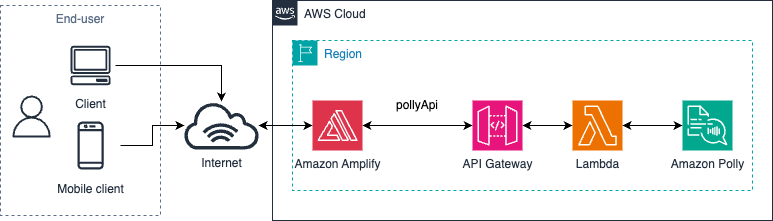

# Amazon Polly Voice Synthesis Application

A simple web application that converts text to natural-sounding speech using Amazon Polly. Users can select different voices and enter custom text to be synthesized into audio that plays directly in the browser.

## Architecture



### How It Works

1. The React frontend (hosted in AWS Amplify) allows users to select a voice and enter text
2. When the user clicks "Speak", a POST request is sent to an Amazon API Gateway
3. The Amazon API Gateway forwards the request to a backend an AWS Lambda function
4. The AWS Lambda function calls Amazon Polly to synthesize speech
5. The audio is returned as base64-encoded data
6. The React frontend decodes the audio and plays it in the browser

## Project Structure

```
my-polly-app/
├── amplify/                      # Amplify backend configuration
│   ├── backend/
│   │   ├── api/                  # API Gateway configuration
│   │   │   └── pollyApi/
│   │   └── function/             # Lambda function
│   │       └── pollyFunction/
│   │           └── src/
│   │               └── index.py  # Python Lambda handler

│   └── team-provider-info.json   # Environment configuration
├── public/                       # Static assets
├── src/                          # React source code
│   ├── App.js                    # Main application component
│   ├── App.css                   # Application styles
│   ├── index.js                  # Application entry point
│   └── aws-exports.js            # AWS configuration (auto-generated)
├── package.json                  # NPM dependencies
└── README.md                     # This file
```

## Features

- **Natural-sounding speech** using Amazon Polly's neural voices
- **Multiple voice options** including male and female voices
- **Custom text input** for synthesizing any text
- **Real-time audio playback** directly in the browser
- **Responsive design** that works on desktop and mobile devices
- **Loading indicators** for better user experience

## Technologies Used

- **Frontend**:
  - AWS Amplify with JavaScript library
  - React framework
  - HTML5 Audio API

- **Backend**:
  - Amazon API Gateway
  - AWS Lambda (Python runtime)
  - Amazon Polly
  - AWS IAM for security

## Prerequisites

- Node.js and npm installed on your development machine
- AWS account with appropriate permissions
- AWS CLI installed and configured with access credentials
- AWS Amplify CLI installed (`npm install -g @aws-amplify/cli`)
- AWS IAM user with the following permissions:
  - IAM (for creating roles and policies)
  - Lambda
  - API Gateway
  - CloudFormation
  - S3
  - Amazon Polly

### Setting Up AWS Credentials

1. **Create an IAM User**:
   - Sign in to the AWS Management Console
   - Navigate to IAM service
   - Create a new user with programmatic access
   - Attach policies for the required services (AdministratorAccess for simplicity, or more granular permissions)

2. **Configure AWS CLI**:
   ```bash
   aws configure
   ```
   Enter your:
   - AWS Access Key ID
   - AWS Secret Access Key
   - Default region
   - Default output format (json)

3. **Configure Amplify CLI**:
   ```bash
   amplify configure
   ```
   Follow the prompts to set up an Amplify IAM user (you can use the same user created above).

## Setup and Deployment

### Installation

1. Clone the repository:
   ```bash
   git clone https://github.com/MardiantoS/vocalize-ai-polly.git
   cd vocalize-ai-polly
   ```

2. Install dependencies:
   ```bash
   npm install
   ```

3. Initialize Amplify (if not already initialized):
   ```bash
   amplify init
   ```
   Follow the prompts to configure your project.

### Local Development

The backend: API Gateway, Lambda function, and related IAM permission needs to be created first:
```bash
amplify push    # Deploy backend resources
```

Run the application locally:
```bash
npm start
```

The application will be available at http://localhost:3000

### Deployment

Deploy the application to AWS:
```bash
amplify publish # Deploy frontend and backend
```

## Key Implementation Details

The application consists of three main components:

1. **React Frontend**: Handles user interface, API calls, and audio playback
2. **API Gateway**: Provides HTTP endpoints for the frontend to communicate with the backend
3. **Lambda Function**: Processes requests and interacts with Amazon Polly

The Lambda function requires permissions to access Amazon Polly, which are configured through IAM roles created by Amplify.

## Security Considerations

- The Lambda function has IAM permissions limited to only the required Polly actions
- API Gateway handles request validation
- CORS headers are properly configured to restrict access if needed
- Consider implementing authentication for production use

## Limitations

- Audio playback requires an internet connection
- There are usage limits for Amazon Polly based on your AWS account
- Some browsers may have autoplay restrictions that require user interaction

## Troubleshooting

- **Audio not playing**: Check browser console for errors; some browsers require user interaction before playing audio
- **API errors**: Verify that your Lambda function has proper permissions to access Polly
- **Deployment issues**: Check CloudFormation logs in the AWS Console for detailed error messages

## Future Enhancements

- Add support for SSML (Speech Synthesis Markup Language)
- Implement audio download functionality
- Add language selection for multilingual support
- Integrate with other AWS services like Amazon Translate
- Add user authentication to track usage

## License

This project is licensed under the MIT License - see the LICENSE file for details.

## Acknowledgments

AWS team for the comprehensive services used in this project

---

*This project was created by the author as a demonstration of AWS Amplify and Amazon Polly integration.*